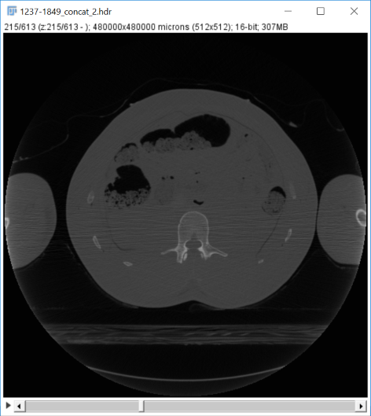

# ircad data

## Advisory

> 2022-08-01: Historical document included below.  Links and directories may or may not work.  No effort is undertaken to restore broken links, as this is document is now only for context.

## Goal

Create a 3D solid model of the human ~~head~~ chest from medical images without human intervention.

## Data

The 3D-IRCADb-01 database contains 3D CT scans of 10 males and 10 females with
hepatic tumors in 75 percent of the cases.  Patient-specific data follow, which
is an extraction from the source 
[table](https://www.ircad.fr/research/data-sets/liver-segmentation-3d-ircadb-01/).

> 2022-08-01: Currently only `patient_1` and `patient_2` have been uploaded to the G Drive.

| Patient No. | Sex | DOB  | Voxel Size (mm)  | Image Size (pixels) | G drive link                                                                                          |
| ----------- | --- | ---- | ---------------- | ------------------- | ----------------------------------------------------------------------------------------------------- |
| 1           | F   | 1944 | 0.57, 0.57, 1.6  | 512, 512, 129       | [patient_1](https://drive.google.com/drive/folders/11NsNjMkWVIVS9l6xd44x282TyW7PRxjD?usp=**sharing**) |
| 2           | F   | 1987 | 0.78, 0.78, 1.6  | 512, 512, 172       | [patient_2](https://drive.google.com/drive/folders/1TYpklL2Se09Y2LhzhGs9Ckuuap4iYlUQ?usp=sharing)     |
| 3           | M   | 1956 | 0.62, 0.62, 1.25 | 512, 512, 200       | [patient_3]()                                                                                         |
| 4           | M   | 1942 | 0.74, 0.74, 2.0  | 512, 512, 91        | [patient_4]()                                                                                         |
| 5           | M   | 1957 | 0.78, 0.78, 1.6  | 512, 512, 139       | [patient_5]()                                                                                         |
| 6           | M   | 1929 | 0.78, 0.78, 1.6  | 512, 512, 135       | [patient_6]()                                                                                         |
| 7           | M   | 1946 | 0.78, 0.78, 1.6  | 512, 512, 151       | [patient_7]()                                                                                         |
| 8           | F   | 1970 | 0.56, 0.56, 1.6  | 512, 512, 124       | [patient_8]()                                                                                         |
| 9           | M   | 1949 | 0.87, 0.87, 2.0  | 512, 512, 111       | [patient_9]()                                                                                         |
| 10          | F   | 1953 | 0.73, 0.73, 1.6  | 512, 512, 122       | [patient_10]()                                                                                        |
| 11          | M   | 1966 | 0.72, 0.72, 1.6  | 512, 512, 132       | [patient_11]()                                                                                        |
| 12          | F   | 1973 | 0.68, 0.68, 1.0  | 512, 512, 260       | [patient_12]()                                                                                        |
| 13          | M   | 1951 | 0.67, 0.67, 1.6  | 512, 512, 122       | [patient_13]()                                                                                        |
| 14          | F   | 1970 | 0.72, 0.72, 1.6  | 512, 512, 113       | [patient_14]()                                                                                        |
| 15          | F   | 1946 | 0.78, 0.78, 1.6  | 512, 512, 125       | [patient_15]()                                                                                        |
| 16          | M   | 1950 | 0.70, 0.70, 1.6  | 512, 512, 155       | [patient_16]()                                                                                        |
| 17          | M   | 1942 | 0.74, 0.74, 1.6  | 512, 512, 119       | [patient_17]()                                                                                        |
| 18          | F   | 1958 | 0.74, 0.74, 2.5  | 512, 512, 74        | [patient_18]()                                                                                        |
| 19          | F   | 1970 | 0.70, 0.70, 4    | 512, 512, 124       | [patient_19]()                                                                                        |
| 20          | F   | 1949 | 0.81, 0.81, 2    | 512, 512, 225       | [patient_20]()                                                                                        |

### Potential New Data Source

[CSI 2014](http://csi-workshop.weebly.com/challenges.html)

## HPC SYN hx

### Accessing the p2m directory

Our directory is located at `data/wg-p2m`. You can get to it from your home directory by running `cd ../../data/wg-p2m`.

### Using the same python environment

From `data/wg-p2m`, run `source miniconda/bin/activate` followed by `conda activate p2m`.  

**IMPORTANT: Don't mess with the version of tensorflow, keras, or cuda. That took a while to set up, and while I [Anirudh] do have notes, recreating it might be a bit of a pain.**

### Data and Code

* The data are located in `geometry/doc/pixel2mesh/unet/data/`
* The code is located in `geometry/doc/pixel2mesh/unet/unet_keras/`

## Code description

### `data_gen_np.py`

This module defines the `PatientData` object.  

* `PatientData` looks for files in the 3DIRCAD data folder. The database
    contains DICOM files located in different folders, PATIENT_DICOM which
    contains the original CT scans, and MASKS_DICOM, which contains subfolders
    of masks of the CT scan. For example, the directory MASKS_DICOM/bone will
    contain the corresponding bone masks for images in PATIENT_DICOM
* You can then call `PatientData.get_data`, which resizes and normalises the
    data before splitting it into train and test and saving them out as .npy files

### `make_data_np.py`

This module creates a PatientData object and calls get_data to save the scans and
masks as numpy files.

### `model.py`

This module defines the function `get_unet` which returns a compiled U-Net model.
A description of the model can be found in the file itself or in the [U-Net paper](https://arxiv.org/abs/1505.04597).

### `losses.py`

This module defines three functions.

1. [`dice_coef`](https://en.wikipedia.org/wiki/S%C3%B8rensen%E2%80%93Dice_coefficient), which is defined as DSC = 2|X ∩ Y| / (|X| + |Y|) 
2. `dice_coef_loss`, which defines the loss as `1-dice_coef`. `-dice_coef` is equally acceptable, but less readable as we generally expect the loss to have converged at 0 and not -1
3. `dice_coef_no_tf` again defines the dice coefficient, but this time without using tensorflow functions. This is useful for visualizing results.

### `callbacks.py`

This module implements the callbacks used during the training of our U-Net model. We use the standard ModelCheckpoint, ReduceLROnPlateau, and EarlyStopping callbacks, while defining an additional StopTraining callback, which stops the training if the dice coefficient reaches 1.0.

### `train_np.py`

This module loads the numpy files and trains.

### `eval_model.py`

This module evaluates our model on the test data.

### `make_predictions.py`

This module predicts what the mask for a given scan will look like and saves the result to a .npy file

### `visualize_pred.py`

This module shows a plot comparing our prediction with the true result.

### `patient_film.py`

This module plots a nice animation scrolling through a patient's scans.

## Updates

### 2020-03-02 Chad, Ryan, Anirudh

* Bone (UNet) and skin (edge detection), Patel -> Done
* Pixel to Voxel to Mesh, perhaps with Sculpt to smooth skin, Terpsma
* Movie Unet, Patel
* Isogeometric Analysis (IGA), Hovey

### 2019-08-26 Chad, Ryan 

* Python post-processing scripts `p2m.py` and `p2mServer.py`.

### 2019-05-29 1400-1500 (Chad's office)

### 2019-05-15 1400-1500 (Ryan's office)

### 2019-05-06 (512x512 Update)

* We now have a model trained for segmenting bone from CT scans at a resolution of 512x512
  * It achieves a test accuracy of 92% on examples held out from the IRCAD database
    * The test set is comprised of randomly selected images across all scans. We do not hold out a single patient for testing 
    * Where the model sometimes fails is when it sees a bright region in the scan, which is not bone. Often these will be classified as bone.
      * In my opinion, this is not currently worth investigating further. This is probably something that will resolve itself with more data and a model for segmenting more classes
* Changed visualisation as per Chad's email. `visualize_pred.py` and `patient_film.py` -> Now, from left to right, "Scan", "True", "Pred"

### 2019-05-01 1400-1500

Plan

* Review Anirudh's incremental progress
* Asses the email from Chad to Anirudh, 2019-04-17 'touch base', regarding putting VHP scans used to create Bob into the Geometry repo.
* Discussion
  * Trade off: Bob versus French-Bob demonstration.  Bob produces apples-to-apples comparison
  * Order of (128-171) slices to French-Bob, 3 ft = 36 in = 91 cm -> 91 cm / 171 slices ~ 0.5 cm / slice = 5 mm / slice.
  * Bob is ~ 1 mm slice, 535 slices = 535 mm = 53.5 cm
  * MedPy to read `.raw` and `.img`
* Current implementation
  * Downsampled to 128 x 128 pixels, original was 512 x 512 pixels.
  * Training: 1.5 hour plus a lot of up front tweaking and trial and error
  * Testing: less than 1 second per image
  * 21 patients  
  * 2258 slices to train (80% net to train, 20% hold out for validation, aka development)
  * 565 slices to test
  * Python environment on HPC-LO and HPC-SYN `conda activate p2m`
* Decision: use French-Bob, not Bob, for demonstrator to sponsors.  Rationale:
  * Bob scan is circa 2000, 19 years old; versus French data set circa 20xx.
  *  **Figure: XX** Representative slice from the Bob data set.
  * Bob CT scan has torso and arms; French data set has only torso (makes training inhomogenous).
  * Bob CT scan has circular boundary halo; French data does not.
  * MedPy library not compatible with Conda, difficult to `sudo install` on HPC-Lo and HPC-Syn, versus French study 100% set up and running today.
  * Apples-to-orange on scan settings and quality: Bob of unknown scan setting state, versus French scans all from the same scanning source.
* Month of May 2019
  * Ani
    * Keep 128 algorithm as is, give output (0, 1) to Ryan
    * Figure out grayscale that we think should be (0, 1)
    * Develop 512 algorithm
    * Dice coefficients distributions for all 21 patients on 512 data set
  * Ryan
    * First-pass workflow on 128 data (0, 1) to voxels, with Ludwigsen's octalump `od` in Linux.
    * Develop bitmap, then use in CTH and/or Sculpt to produce voxel mesh.
    * Nice high resolution spyplot images of mesh for presentation to sponsor.

### 2019-04-25

* Added the ability to read data for a single patient and make predictions on them. 
* Ran out data on patient_1. 
  * To visualise, use patient_film.py.
* Moved data and code to HPC-SYN and set up git to work with HPC-SYN. 
  * To get to it, after sshing, run `cd ../../data/wg-p2m`
* Added a miniconda installation into /data/wg-p2m/ that will enable all of us to work with the same python installation.
  * To use, from /data/wg-p2m, run `source miniconda/bin/activate` and then `conda activate p2m`

### 2019-04-24

* From Ben Green, part of the Common Engineering Environment High Performance Data Analytics Team, container **hpc-syn-wg-p2m** ready for use on port *call* for members of `wg-p2m` metagroup.

### 2019-04-23

* Anirudh adds comments and constants and deletes unnecessary files.
* **TO RUN**:
  * Create a dataset by running make_data_np.py
  * Train by running train_np.py
  * Evaluate on the test set by running eval_model.py
  * Save the predictions to numpy files by running make_predictions.py
  * Visualise by running visualize_pred.py.
    * **NOTE:** If you run this, you must get through all images. You can't Ctrl+C out of the script. If you don't get through all images, you will need to close that terminal window.

### 2019-04-23

* Anirudh fixes [U-Net](https://arxiv.org/abs/1505.04597) model
  * Now trained on the full dataset (reserving 20% for test and 16% for validation)
  * Achieves a test [dice score](https://www.ncbi.nlm.nih.gov/pmc/articles/PMC1415224/) of 91.5%
     * This is slightly worse than before (93.5%), but it should perform better on unseen data as it was exposed to more data = more variance
  *  Code no longer in a notebook and has now been refactored.
  *  Keras instead of Tensorflow
  *  Comments not yet included. Will update when they are included
* Training Details/Notes for Future Re-Training:
  * Data Pre-Processing:
    * The data should be normalized to be between -1.0 and 1.0
    * Masks should be a binary array (consisting of only 0.0 and 1.0)
    * Data should be stored as .npy files under 
      * data/train/image/x_train.npy, train_files.npy
      * data/train/label/y_train.npy
      * data/test/image/x_test.npy, test_files.npy
      * data/test/label/y_test.npy
  * Training
    * [Adam Optimizer](https://arxiv.org/abs/1412.6980v8) with learning rate = 1e-3 (and default keras params)
    * Sigmoid is used as the activation function for the final layer to ensure output pixel values between 0 and 1
    * Minibatch size = 32 -> chosen experimentally to be large enough to be informative about the direction of the gradient (think Law of Large Numbers), but small enough that the regulariser (part of Adam) is able to properly regularise.
    * Loss function is the dice_coef_loss, implemented in unet_keras/losses.py
    * Callbacks include ModelCheckpoint (saves weights), ReduceLROnPlateau (reduces the learning rate when a monitored value levels off), and EarlyStopping (stops if no improvement), and StopTraining (stops the training when a monitored value reaches 1.0)
      * Using val_dice_coef (validation dice coefficient) for monitoring progress of the model
    * **Key Insight**: Use standard weights initialisation, not he_normal
    * May need to stop training and re-run for best weights of last run since the patience isn't quite right for ReduceLROnPlateau
    * Weights saved to weights/
      * Change the name of the weights file after each run to ensure that they aren't overwritten
* Post-Training:
  * Evaluate the model using eval_model.py. You may need to go in and change the weights file name in the script
  * Make predictions stores predicts the output of the model run on the test set and saves them to:
    * data/test/dices.npy, preds.npy
  * Run visualize_pred.py to see the difference between the predicted (left) and hand-labelled (right) data.

### 2019-04-18

* Anirudh asks Chad to get a HPC-SYN node, which would allow training data to be stored in a single location.
  * Create new working group `wg-p2m` (Working Group pixel2mesh) 
  * Create HPC-SYN Team Environment
    * Project Name: pixel2mesh
    * Team Metagroup: wg-p2m
    * Number of GPUs: 1
    * Primary ML/DL Use Case: Segmentation of medical image for mesh creation.
    * Shared data folder will be `/data/pixel2mesh`

### 2019-04-17 1400-1500 T75/9

* Cancel this meeting, Anirudh got committed to other priorities, and could use more time.

### 2019-04-15

* Candice, Chad
* Candice located the frozen CT and color photographic images she used to create Bob's torso.
  * She did not use MR data, as it was difficult to see the soft tissue; she used the color images instead.
  * For the color images, there are three sets:
    * Raw images downloaded from Visible Human Project
    * Aligned raw images - same as above, but some images were not in layer-to-layer alignment, hence this second set was made.
    * Concatenated images - of the aligned raw images, but in two sets because a memory limitation issue (CN remember details) prohibited putting all the images in a single set.  The two sets of data, less that 2 GB each, indicate the layer numbers in the title.
  * For the CT images, there is only one stack.
  * Applications for reading the image files, in `.raw` or `.img` format, use one of the following:
    * [ImageJ](https://imagej.net/)
    * [Jim](http://www.xinapse.com/Manual/index.html)
    * [Amira](https://www.thermofisher.com/us/en/home/industrial/electron-microscopy/electron-microscopy-instruments-workflow-solutions/3d-visualization-analysis-software.html)
  * Chad to move images
    * from Dept server
    * to `geometry/data/bob/VHP/torso/` (VHP = Visible Human Project, [link](https://www.nlm.nih.gov/research/visible/visible_human.html))

### 2019-04-09 DD, KR, Hovey

* KR states that DS is coding CTH to read diatoms directly.
* Get slides from DP presented in CTH Town Hall, regarding CTH diatom read.
* Chad asks if this does segmentation or not, which is the crucial step.  A: Unknown.

### 2019-04-03 1400-1500

* Chad, Anirudh
* More U-Net, supervised, with 3D-IRCAD-B1 labeled data set, from [L'Institut Recherche contre les Cancers de l'Appareil Digestif](https://www.ircad.fr/fr/recherche/3d-ircadb-01-fr/) in France.
* HPC-LO for project (not HPC-SYN, larger GPU).
* 30 min to train network.
* Original size 512x512, downsampled to 128x128, now 30 min to train.
* Additional data can cause gradients to vanish.
* Used Tensor Flow this time.
* 90 percent of time prefer keras, 10 percent tensorflow.
* Manual reconstruction of U-net strategy.
* Dice coefficients: intersection over union, result is 93.8 percent coefficient.
  * 93.8 percent of ground truth (true labels) should overlap (as number of pixels) predicted value; this is the intersection.
* DICOM viewer [https://www.osirix-viewer.com/](https://www.osirix-viewer.com/)
* Demonstrated segmentation first of bone, then attempted lungs.
* Anirudh to segment all 20 patients, put 1 pt on GitLab, not 20.
* Chad to talk Ryan about demonstrating A-to-Z workflow: pixel 2 segmentation 2 mesh (voxel or elements).

### 2019-03-13 1330-1500 T75/9

* Chad, Anirudh
* Anirudh demonstrated first-cut Python implementation with U-Net (supervised, with labelled data), and W-net (unsupervised) deep learning architecture.
* Chad to 
  * get repo organized
  * data sets from Visible Human Project
  * labeled data
  * recurring biweekly schedule
  * next meeting with Cari, Anirudh, Chad
  * spend plan  
* Candice's email
  * Color images, CT, and MR on Org 5421 Department Server 
    * CT scans easiest for segmenting bone are in the `Radiological` subdirectory.
  * See `geometry/data/bob/VHP/example` for two `.hdr` and `.img` files, which are common CT and MR image formate created by Analyze, a medical image program.
    * [ImageJ](https://imagej.nih.gov/ij/), Amira, or Jim (by xinapse) are alternatives.

### 2018-12-18

* Cari Martinez, CS UNM optimization and genetic algorithms, BS math
  * Worked with Scott Roberts for battery project, and Kevin Potter, John Korbin, Steve Attaway for CT-CTH process.
* David Peterson
* Kevin Potter
* Matt Smith
* Scott Roberts
* Plan to do segmentation, not classification (e.g., cat or not cat in image)
  * Each pixel is part of the training set
* CycleGAN, adversarial network, unsupervised technique, horses into zebras, and back again.
  * Train two neural networks, e.g., counterfeit money
    * Generator - creates money
    * Discriminator - decides real versus fake
* Batteries - some labeled data, and foam has no labelled data
* Steve Owen with a separate projects in 1400, Tim Chen in 1400
* CTH scans 240x240
* CBH actions
  * CT, MR, Photos and gold standard labelled data to GitLab repo
* Martinez deliverable
  * 1-week effort, followed by 4-6 week effort, if needed
  * Demonstration of pixel2mesh workflow.

### 2018-11-27

* Doug, Chad, Ryan, Anirudh, Anton
* Anirudh to search for paper that already does segmentation

### 2018-11-20

* Scott Alan Roberts, Lincoln Collins, Ryan, Chad
* Scott A. Roberts, Credible Automated Meshing of Images ([CAMI](CAMI-high-level-overivew-201911.pdf))
* Geometry of particles, x-ray, CTH, image data
* Amira is now Aviso, name change, use Aviso for smoothing
* ML code - V-Net, deep neural network code, external and brought in house, called *Sandia V-Net*
* HPC-SYN cluster, free sign up, GPUs, dedicated to ML work
* Scott to provide CAMI slides (done) and introduce to 880 ML group [Cari Martinez et al.] (done).

## Motivation

The creation of a 3D solid model of the human head, suitable for analysis
(e.g., finite volume voxelation or finite element mesh)
from medical imaging data (e.g., MRI, CT)
is currently a manual
process that requires significant human training and
time to understand and perform the model creation process.

* Example of the Bob FV mesh
* Estimate for number of hours, number of people, and cost

The specific **goal** of this work is to create platform that
constructs finite volume human head models from medical imaging data without a human in-the-loop.

### Benefits

* Personalized medicine
* Cease reliance on singleton model instances

